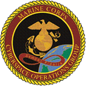

  

  # DCO 550
  ### Advanced Adversary Hunting & Malware Reverse Engineering

  
  
  
  

---

## 📄 Overview

**DCO 550** is the definitive capstone platform for the modern cyber defender. Designed to elevate analysts to elite adversary hunters, the course plunges operators into the proactive, adversarial mindset required to track and dissect sophisticated threats. 

This repository contains the complete source code, infrastructure automation, and instructional materials for deploying the DCO 550 high-fidelity cyber range and mission briefing platform.

---

## 🏹 The Hunter's Triad

The curriculum and its underlying architecture are engineered around a unified, three-pillar methodology:

1. **Advanced Forensics**: Deep-dive analysis of memory, file systems, and timeline artifacts to uncover adversary activity that evades traditional security tools.
2. **Malware Reverse Engineering**: Static and dynamic analysis of malicious executables and scripts, utilizing disassemblers and debuggers to extract IOCs and understand code logic.
3. **Data Science & Automation**: Building robust ETL pipelines in Python and applying statistical models to scale hunting efforts and mathematically identify anomalies.

---

## 🏗️ Repository Architecture

| Component | Path | Description |
| :--- | :--- | :--- |
| **Mission Platform** | `courses/adversary-hunting/` | Tactical web interface (Astro) serving as the command center for operator checklists, operational phases, and the mission journal. |
| **Infrastructure** | `infrastructure/` | Enterprise-grade IaC (Terraform, Packer) for automated provisioning of isolated student cyber ranges and hardened golden images. |
| **Documentation** | `docs/` | Technical specifications, daily wrap-ups, and comprehensive lab methodologies. |
| **AI Governance** | `.agent/` | Specialized autonomous agents and skills responsible for continuous course validation and maintenance. |

---

## 🚀 Range Deployment & Operations

The DCO 550 environment leverages a **Dual-Track CI/CD** architecture to ensure stability and precise isolation for malware analysis.

### 🛡️ Tactical Environment
- **Isolated Subnets**: Student ranges operate within strictly segregated `172.16.X.0/24` networks, guaranteeing safe execution of live malware payloads.
- **Pre-Instrumented Images**: Golden images are built dynamically via Packer, pre-loaded with critical analysis toolsets including Ghidra, Volatility 3, x64dbg, and Plaso.
- **Telemetry Streaming**: Native integration with Microsoft Defender for Endpoint (MDE) streams high-fidelity telemetry to a centralized Sentinel workspace for hunt operations.

### ⚙️ Orchestration
1. **Track 1**: Containerized delivery of the Mission Briefing platform via GitHub Actions.
2. **Track 2**: Full-stack infrastructure provisioning via GitLab CI/CD, managing the complete lifecycle of the Azure-based ranges.

---

**Lead Architect**: Iver Iverson  
**System Status**: `NOMINAL` // `OPERATION ADVERSARY HUNT ACTIVE`

  DCO 550 // Advanced Adversary Hunting

